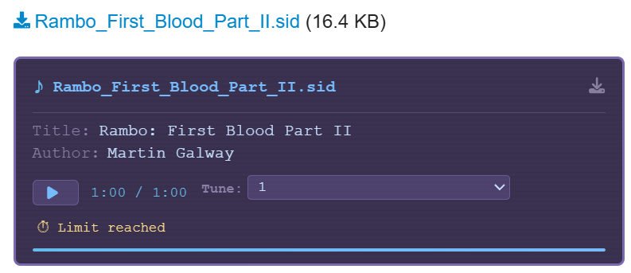

# discourse-sid-preview

Inline SID file preview player for Discourse that lets users play Commodore 64 `.sid` files directly in forum posts.

## Overview

When a user uploads a `.sid` file to a post, this plugin detects the download link and renders a compact inline player below it. The original download link remains intact.



## Engine

The plugin now uses a WASM-based playback stack (not jsSID):

- `websidplay.wasm` (libsidplayfp / reSIDfp emulation core)
- `websidplay-backend.js` (Emscripten bridge and `SIDPlayBackendAdapter`)
- `scriptprocessor_player.min.js` (ScriptNodePlayer WebAudio framework)

At runtime, `sid-player-engine.js` loads these assets from `/sid-player/`, creates a fresh ScriptNodePlayer instance per track load, and preserves the same public `SIDPlayer` API used by the UI component.

## Features

- Play / Pause / Stop / Restart controls
- Auto-stop at configurable time limit (default 60 seconds)
- SID metadata display (title, author)
- Subtune selector for multi-tune SID files
- Progress bar
- Non-intrusive - only activates on posts containing `.sid` links

## Plugin Settings

| Setting | Default | Description |
|---|---|---|
| `sid_preview_enabled` | `true` | Master toggle |
| `sid_preview_max_seconds` | `60` | Auto-stop limit |
| `sid_preview_default_model` | `6581` | Default SID chip model |

Important: Add `sid` to your Discourse `authorized extensions` site setting so uploads are accepted.

## Installation

### Option A: Git clone during init (recommended for k8s setup)

Add to your Discourse init script:

```bash
cd /var/www/discourse/plugins
git clone https://github.com/tonyfruzza/discourse-sid-preview.git
```

## Runtime Notes

- Keep `vendor/sid-player/` in the repository. On boot, `plugin.rb` copies these files into `public/sid-player/` so the browser can load the WASM engine.
- The plugin extends CSP with `'wasm-unsafe-eval'` for WebAssembly compilation.

## Credits

- websidplayfp (libsidplayfp / reSIDfp) by Juergen Wothke: https://bitbucket.org/wothke/websidplayfp/
- ScriptNodePlayer by Juergen Wothke: https://bitbucket.org/wothke/websidplayfp/
- DeepSID by Chordian (reference integration and adapter assets): https://github.com/Chordian/deepsid
- libsidplayfp project (upstream SID emulation library)
